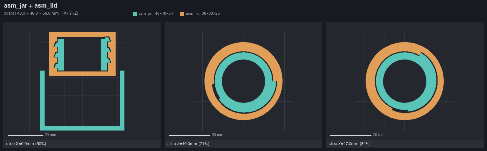
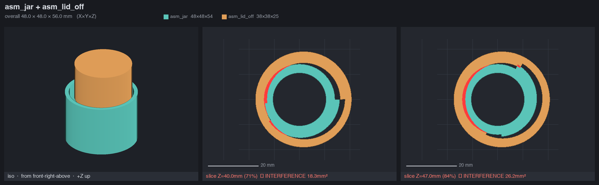
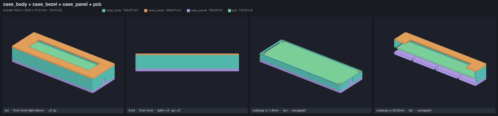
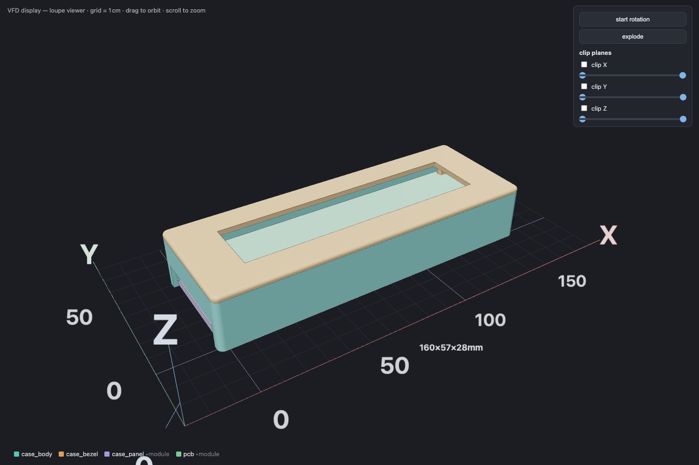
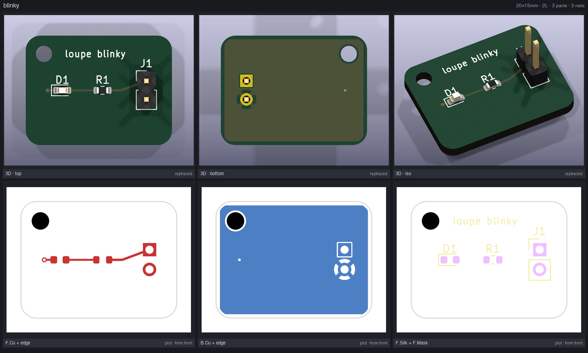

# loupe

**A code-CAD review pipeline for 3D printing and PCBs: render it, prove it, preview it, slice it — or fab it.**



Single-file [`uv`](https://docs.astral.sh/uv/) scripts — zero setup, inline dependencies — that turn a parametric model into something you (or an LLM agent) can actually *trust* before committing filament (or a fab order) to it:

```
CAD script (build123d / CadQuery)
   → check.py    assert geometry facts — FAILS LOUDLY if a part floats, collides, or has a thin wall
   → sheet.py    a labeled contact sheet: 8 named views + slices + interference painted red
   → viewer.py   a self-contained browser viewer: orbit, clip planes, explode, mm grid
   → slice.py    headless Bambu Studio: errors, print time, filament grams, cost — then print

board script (import pcb — parts + nets + routes, in Python)
   → pcbcheck.py  headless KiCad DRC — FAILS LOUDLY on violations, unrouted nets, netless pads
   → pcbsheet.py  one contact sheet: raytraced 3D top/bottom/iso + true copper/silk layer plots
   → pcbfab.py    gerber/drill zip, JLCPCB BOM + CPL, STEP — and an STL that feeds the row above
```

A loupe is the glass a jeweler holds to a gem, a printer to a proof sheet — the tool for catching the flaw under magnification before it costs you. These scripts are that glass for parametric CAD: they put the part under scrutiny before the printer ever does.

---

## Why this exists

The reliable way to do CAD with code in 2026 isn't GUI-automation-over-a-protocol, and it isn't text-to-CAD. It's three things working together:

1. **Code-CAD** — parametric Python (build123d / CadQuery, both on the OpenCascade kernel). The model is a program: diffable, versionable, reproducible.
2. **Deterministic geometric verification** — machine-checkable assertions a render can *never* guarantee (does part A actually collide with part B? is any wall under 1.2 mm? is the mesh watertight?). Exits nonzero when a fact is false.
3. **Rendered eyes** — a labeled contact sheet you look at, and a browser viewer a human opines on.

This pipeline was built during a real reverse-engineering job — modeling a part to interoperate with a commercial product. On its first day it caught **four** genuine assembly bugs (a body floating 53 mm off the floor, a 1 mm bore offset masquerading as thread interference, a hardcoded floor constant, a phantom interference from an un-rotated helical part) *before a single render existed*, and the printed test parts fit the commercial reference on the first try.

It's written to be driven by a human at a terminal **or** by an AI coding agent — the contact sheet exists precisely because an agent can `Read` a PNG, and the deterministic checks exist because "looks right" is not a specification.



*A staged collision: the screw lid shoved off-axis so its thread crashes the neck. `sheet.py` paints the overlap red and prints the measured area into the caption; `check.py` turns the same fact into a nonzero exit code. This is the thing a pretty render can never tell you.*

---

## Requirements

- **[uv](https://docs.astral.sh/uv/)** — that's it for the first three tools. Each script declares its own dependencies inline ([PEP 723](https://peps.python.org/pep-0723/)); `uv run` resolves them into a throwaway environment on first invocation. No `pip install`, no virtualenv to manage.
- **Python ≥ 3.11** (uv will fetch one if you don't have it).
- **`slice.py` only:** a local **Bambu Studio** install. Paths default to macOS (`/Applications/BambuStudio.app`); adjust the two constants at the top for Linux/Windows. The other three tools are cross-platform.

```sh
git clone https://github.com/<you>/loupe.git
cd loupe
uv run check.py your_part.stl        # first run resolves deps; subsequent runs are instant
uv run examples/threaded_jar.py      # regenerate the threaded-jar model used in the shots above
```

---

## The tools

### `check.py` — deterministic geometry verifier

Machine-checkable facts renders can't guarantee. Reports always; exits nonzero on a failed assertion, so you can wire it straight into a build.

```sh
uv run check.py part.stl                                          # watertightness + report only
uv run check.py asm_body.stl asm_lid.stl --interference-max 0.05  # exact 3D boolean overlap volume, mm³
uv run check.py col.stl bore.stl --clearance "col:bore:0.15@z=2:18"  # min gap, region-scoped
uv run check.py part.stl --min-wall 1.2 --overhang 45 --json      # thin-wall + unsupported-area report
```

- **Interference** = exact manifold boolean volume between every pair of parts, always reported.
- **Clearance** samples part A's surface and measures signed distance to part B (negative = penetration). Scope it with `@z=lo:hi` — parts that legitimately touch elsewhere (a flange resting on a rim) otherwise read 0.
- **Watertightness** is always checked. `--min-wall` is an inward ray-cast; `--overhang DEG` reports unsupported area (the bed face is excluded).

### `sheet.py` — labeled contact sheet (the reviewer's eyes)

Renders one or more meshes into a single PNG: 8 named orthographic/iso views + custom camera angles, 2D cross-section slices with **automatic part-vs-part interference detection** (overlap painted red, mm² in the caption), 3D cutaways, and region zoom. Every tile is captioned with its camera position and screen axes — trust the captions, not your assumptions.


```sh
uv run sheet.py body.stl lid.stl -o sheet.png
uv run sheet.py a.stl b.stl --slice z=50% --slice z=12,15 --slice x=50%
uv run sheet.py a.stl b.stl --cutaway "y>50%" --views iso,front,top
uv run sheet.py a.stl b.stl --view=-25,12 --roi "z=45:62" --slice z=52   # close-up on a region
uv run sheet.py a.stl --views none --slice z=10,20,30                    # slices only
```

- `--view AZ,EL` sets a custom camera. Use the `=` form for **negative** azimuths (`--view=-25,12`) — argparse eats a bare leading dash otherwise.
- `--roi "z=45:62[,x=..]"` zooms *every* tile onto a region, keeping any triangle that overlaps it.
- Surfaces that touch by design flag a few mm² of contact sliver; judge by the reported area — real collisions are 10–100× bigger.
- `--cutaway "z>50%"` (repeatable) removes everything past a plane and re-triangulates the cut faces exactly on it — the internal stack reads clean, no jagged straddling facets.



### `viewer.py` — self-contained browser viewer (the human's eyes)

One HTML file (GLB embedded as base64, three.js from CDN): orbit controls, an adaptive mm grid with tick numbers in **world mm on all three axes**, per-part legend, explode toggle, auto-rotate (remembered in localStorage), and **double-ended clip sliders per axis** (keep the slab between two handles).



```sh
uv run viewer.py body.stl lid.stl -o preview.html --title "My part"
uv run viewer.py case.stl panel.stl pcb.stl glass.stl io.stl \
    --group module=pcb,glass,io -o preview.html   # module stays rigid on explode
open preview.html
```

The grid coordinates match `sheet.py`'s slice coordinates exactly — "clip Z 50:55" in the viewer and `--slice z=52` in the sheet are the same place. `--group NAME=a,b,c` (repeatable) makes those parts explode as one rigid body, so an assembly (PCB + glass + connectors) stays together while the shells fly off.

### `slice.py` — headless Bambu Studio

Wraps the Bambu Studio CLI (P1S profiles by default): slices one arranged plate and reports success/error, predicted print time, filament grams/meters, spool cost, per-object bounding boxes, and slicer warnings. Writes the ready-to-print `.gcode.3mf` next to the inputs.

```sh
uv run slice.py part1.stl part2.stl                         # one plate, P1S defaults
uv run slice.py part.stl --process "0.12mm Fine @BBL X1C" \
    --filament "Bambu PETG Basic @BBL P1S 0.4 nozzle"
uv run slice.py --list-processes | --list-filaments | --list-machines
```

Defaults: P1S, 0.4 nozzle, 0.20 mm Standard, Bambu PLA Basic. Filament weight is computed from the gcode's extruded length × profile density (the CLI leaves `used_g` at 0). **macOS/Bambu-specific** — edit the `APP` and `PROFILES` paths at the top for other platforms.

---

## The PCB pipeline

The same philosophy pointed at circuit boards: the board is a program, verification is deterministic (KiCad's real DRC, headless), and review happens on a rendered contact sheet. **The board script IS the netlist** — no schematic, no GUI; declare parts, connect pads, place and route with computed coordinates.



```python
from pcb import Board

b = Board("blinky", w=20, h=15, corner_r=2)          # origin lower-left, +Y UP (build123d frame)
b.part("D1", "LED_SMD:LED_0603_1608Metric", at=(5, 7.5), value="LED red", lcsc="C2286")
b.part("R1", "Resistor_SMD:R_0603_1608Metric", at=(10.5, 7.5), value="1k", lcsc="C21190")
b.part("J1", "Connector_PinHeader_2.54mm:PinHeader_1x02_P2.54mm_Vertical", at=(16.5, 8.8))
b.net("VCC", ("J1", 1), ("R1", 2))                   # the script IS the netlist
b.net("LED_A", ("R1", 1), ("D1", 2))
b.net("GND", ("J1", 2), ("D1", 1))
b.route("VCC", [("J1", 1), (13, 7.5), ("R1", 2)])    # polylines; points are pads or mm
b.route("LED_A", [("R1", 1), ("D1", 2)])
b.route("GND", [("D1", 1), (3, 7.5)])
b.via((3, 7.5), net="GND")
b.zone("GND", layer="B.Cu")                          # pour, filled headlessly
b.hole(2.5, 12.5, d=2.2)                             # NPTH mounting hole
b.silk("loupe blinky", 9.5, 12.5, size=0.9)
b.save("out")                                        # -> out/blinky.kicad_pcb
```

```sh
uv run examples/blinky_coupon.py                     # the script above -> a real .kicad_pcb
uv run pcbcheck.py examples/out/blinky.kicad_pcb     # KiCad DRC gate: nonzero exit on any error
uv run pcbsheet.py examples/out/blinky.kicad_pcb     # contact sheet -> Read the PNG
uv run pcbfab.py  examples/out/blinky.kicad_pcb --mesh   # gerbers.zip + BOM/CPL + STEP + STL
```

### How it works

`pcb.py` is a zero-dependency library with a double life: the half you import builds a JSON spec of the board; on `save()` it re-invokes itself **under KiCad's bundled Python** (the only place `pcbnew` exists) to materialize a genuine `.kicad_pcb` — real footprints from KiCad's libraries, real nets, filled zones. Everything downstream is `kicad-cli`: DRC, raytraced renders, layer plots, gerbers, position files, STEP.

Design rules are baked in from a **fab profile** (JLCPCB 2-layer by default: 0.127 mm min track/space, 0.3 mm min drill, 0.3 mm copper-to-edge), so `pcbcheck.py` enforces what your fab can actually build. Unrouted nets and pads you forgot to connect are hard failures — mark intentionally-floating pads with `b.nc(ref, pad)`.

### Case + board co-design

Board coordinates are math-style — origin at the board's lower-left, +Y up, mm — the same frame as a build123d case model. `pcbfab.py --mesh` tessellates the populated board (components included) into an STL that drops straight into `check.py` / `sheet.py` / `viewer.py` next to your enclosure parts: change a mounting-hole constant, regenerate both, and *prove* the standoffs still line up before anything is printed or fabbed.

### PCB requirements & limits

- **KiCad 10** (app bundle provides `kicad-cli`, `pcbnew` Python, and all footprint libraries). macOS paths are auto-discovered in `/Applications/KiCad` or `~/Applications/KiCad`; override with `LOUPE_KICAD=/path/to/KiCad.app`. Heads-up: `brew install --cask kicad` wants sudo (it drops demos into `/Library`); mounting the official DMG and copying the `KiCad` folder into `~/Applications` works without it.
- Routing is **explicit** — polylines you compute, not an autorouter. That's a feature at this scale (sensor carriers, LED boards, connector breakouts, keyboard matrices: placement math *is* the design); it's the wrong tool for a 6-layer RF board.
- 2-layer boards only (v1). BOM/CPL come out in JLCPCB's column format; LCSC part numbers flow from `part(..., lcsc="C1234")`.

---

## A typical loop

```sh
# 1. edit your build123d / CadQuery script, export STLs (individual + assembled `asm_*`)
uv run check.py asm_*.stl --interference-max 0.05 --min-wall 1.2   # gate: fails loudly on real bugs
uv run sheet.py asm_*.stl --slice z=50% -o sheet.png               # look at it
uv run viewer.py asm_*.stl -o preview.html && open preview.html    # let a human opine
uv run slice.py part_a.stl part_b.stl                              # time + cost, then print
```

Model multi-part designs in **assembled coordinates** and export both the individual parts and an `asm_*` set — `check.py` and `sheet.py` do interference detection across whatever files you hand them.

---

## For agents

This pipeline is built to be driven by an AI coding agent as much as a human. Two surfaces:

- **[AGENTS.md](AGENTS.md)** — terse operational guide any agent harness (Claude Code, Cursor, Aider, …) can read: the review loop, the exact commands, and the gotchas that waste tokens.
- **`loupe_mcp.py`** — an MCP server exposing `check`, `sheet`, and `slice`. Crucially, **`sheet` returns the contact sheet inline as an image**, so an agent sees the render in the same turn instead of writing a file and reading it back. Wire it up once:

  ```sh
  claude mcp add loupe -- uv run /ABS/PATH/TO/loupe/loupe_mcp.py
  ```

---

## Field notes (hard-won)

A few things that cost real time to learn:

- **trimesh:** load with `process=True` or CAD-exported STLs aren't `is_volume` (boolean ops refuse triangle soup). `polygons_full` silently drops holes unless **rtree** is installed.
- **Multi-start threads: an axial shift *is* a rotation.** Moving a helical part `dz` along its axis without also rotating it by `360·dz/lead` breaks the mesh phase and produces phantom interference. Applies to through-cut bores and to seating parts in an assembly.
- **Rounding meshes:** there is no reliable one-call "fillet everything." For your own code, fillet at the **sketch** level (2D fillets almost never fail; 3D `fillet(all_edges)` fails constantly on real parts). For downloaded STLs with no B-rep, a morphological offset (e.g. MeshLib's `doubleOffsetMesh`) rounds every convex edge in one pass — but marching-cubes leaves lumpy edges unless you use a fine voxel size and a volume-preserving smoothing pass before decimation. All mesh rounding *moves surfaces* — re-cut functional bores and mating faces afterward; rounding is for the cosmetic 90%, never datum surfaces.
- **Print fits (Bambu P1S, PLA, 0.20 mm — calibrate for your own machine):** ~0.15 mm radial clearance is a snug press fit that can bind under gravity; ~0.25 mm self-slides; ~0.35 mm has noticeable wobble. Elephant foot binds tight fits at end-of-travel.
- **Test at the smallest scale where the measured quantity is still representative.** Local fits → print a coupon/ring. Integral quantities (friction over full engagement, gravity self-slide) → only the full length is authoritative.

---

## License

Apache-2.0 — see [LICENSE](LICENSE) and [NOTICE](NOTICE).
